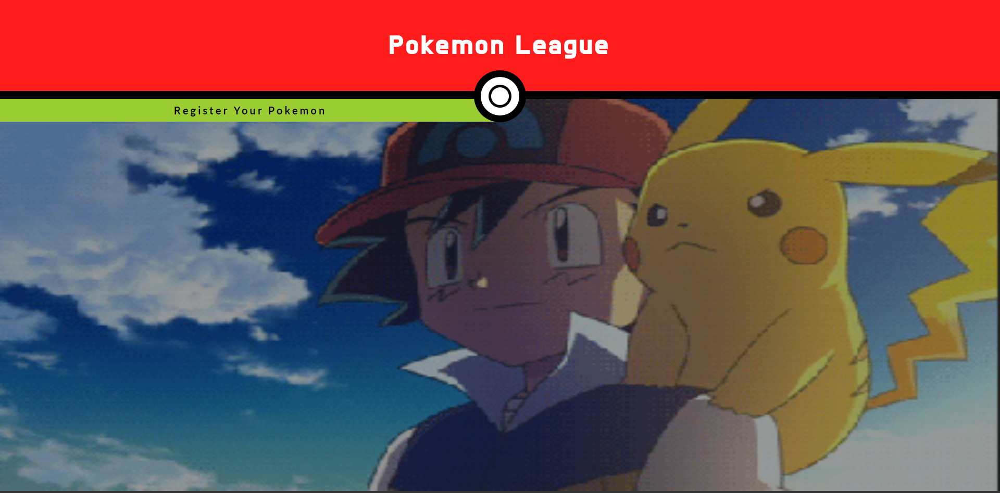
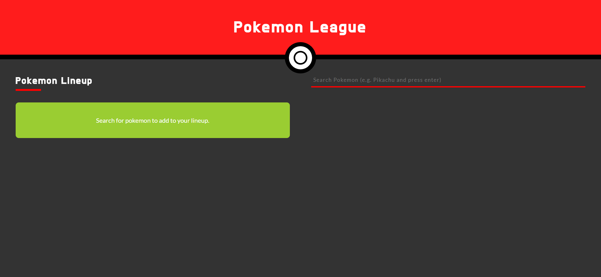

# Pokemon League (A React.js Project)
A web app that let's users sign up for the `Pokemon League` in their journey to become the very best.

## Technologies Used

- [React](https://reactjs.org/)
- [Redux](https://redux.js.org/)
- [React Router v4](https://reacttraining.com/react-router/core/guides/philosophy)
- [Poke Api](https://pokeapi.co/)
- [pokedex-promise-v2](https://github.com/PokeAPI/pokedex-promise-v2)

## Installation
Clone or download the repo.

In your terminal/command line run: `npm install` or `yarn` if you have yarn installed.

Run `npm start` to open app in the browser.

## How to use
When you first load the site you will land on the landing page. You will see a hero giphy of Ash and Pikachu.

### Landing Page

Click the `Register Your Pokemon` button to go to the registration page.

### Registration Page

Type a name of a pokemon in the search bar, let's go with `pikachu`.

### Search Result

You should see a portrait of Pikachu with two buttons, one to view the fetched pokemon data and one to add the pokemon to your lineup. Let's view the pokemon data.

### Pokemon Data

A div in the lower left hand section should pop up with information of the pokemon such as their **type**, **abilities** and **stats**.

Now let's add them to the lineup.

### Add to Lineup

The green info box will be replaced by all the pokemon you choose to add, a maximum of 6 pokemon may be added. Additionally, you may remove a pokemon that you already added by clicking the `x` in the top right hand corner of the portrait.
